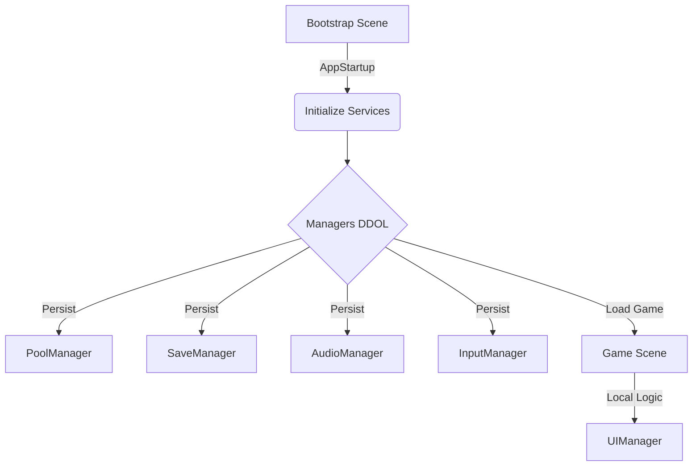

# 🎮 M.S.T. Unity Base Template

<p align="center">
  
  
  
</p>

---

<p align="center">
  
</p>

---

# 🧱 Overview

A **production‑ready Unity 6 template** built for  
**Hyper‑Casual, Idle, Puzzle, and Lightweight Action games.**

**Clean Architecture + Bootstrap Pattern + Zero Singletons.**

**Author:** Muhammet Serhat Tatar (M.S.T.)  
**Repository:** [serhattatar/Unity-Template-Repository](https://github.com/serhattatar/Unity-Template-Repository)

---

# 🏗️ Architecture Diagram



---

# 🔄 Lifecycle

1. **Bootstrap Scene (Index 0)** loads first  
2. `AppStartup` initializes persistent services:
   - `PoolManager`
   - `SaveManager`
   - `AudioManager`
   - `InputManager`
3. Auto‑loads **GameScene**

⚠️ Managers **must NOT** exist manually inside gameplay scenes.

---

# ✨ Key Systems

## 🎱 Zero‑Allocation Object Pooling
Wrapper over `UnityEngine.Pool`.

**Spawn:**
```csharp
_bulletPrefab.Spawn(transform.position, rotation);
```
**Return:**
```csharp
gameObject.ReturnToPool(3f); // Auto-despawn after 3s
```

---

## 💾 Secure Save System
- JSON (XOR encrypted)
- Auto‑save on pause & quit
- Main entry: `SaveManager.Data`

```csharp
int coins = SaveManager.Data.Coins;
SaveManager.Data.Coins += 100;
SaveManager.Save();
```

---

## 🔊 Audio System
```csharp
AudioManager.PlayMusic(_bgMusic);
AudioManager.PlaySFX(_shootSfx, volume: 1f, randomPitch: true);
```

---

## 🎮 Input System (Static API)
A unified API for Touch, Joystick, and Swipe controls. No instance required.

**Setup:** Add `VirtualJoystick` script to your UI Image.

```csharp
// Joystick
Vector3 move = new Vector3(InputManager.JoystickInput.x, 0, InputManager.JoystickInput.y);

// Events
InputManager.OnTap += Jump;
InputManager.OnSwipe += HandleSwipe;
```

---

## 🖥️ UI System (Scene-Based)
Type-safe, stack-based UI architecture.

```csharp
// Show
UIManager.Show<SettingsPopup>();

// Show with Data
UIManager.Show<WinPopup>(new WinData { Score = 100 });

// Hide
UIManager.Hide<SettingsPopup>();
```

---

## 📢 Game Logger (Conditional)
Performance-oriented wrapper. All calls are **stripped** from Release Builds.

```csharp
GameLogger.Log("Standard Log");
GameLogger.Combat("Player hit!"); // Colored: Magenta
GameLogger.Network("Connected");  // Colored: Cyan
GameLogger.Warning("Low Memory");
```

---

## 👑 Boss Mode (Debug Console V8)
A powerful runtime developer console.

- **Access:** Triple-tap the **"DEV"** icon (Top-Right).
- **Alerts:** Icon flashes **Yellow/Red** on warnings/errors.
- **Usage:** Add `[BossControl]` to any field or method.

```csharp
[BossControl("Player/Speed")]
public float MoveSpeed = 5f;

[BossControl("Cheats/Kill All")]
private void KillAll() { ... }

[BossControl("Economy/Gold", true)] // Economy Tab
public static int Gold = 100;
```

---

# 🛠️ Editor Tools

### 🔹 Scene Switcher Overlay
Located in the Scene View Toolbar. Allows instant switching between scenes.
*(Locks automatically in Play Mode).*

### 🔹 Force Bootstrapper
`Tools > M.S.T. > Enable Auto-Bootstrap`
Forces the editor to always start from **Scene 0**, ensuring Managers are initialized even if you press Play in "Level 3".

---

# 🚀 Workflow: Starting & Updating

This project is a **GitHub Template**.

### 🆕 1. Start New Game
1. Click **"Use this template"** on GitHub.
2. Clone your NEW repository.
3. Open in Unity 6.

### 🔄 2. Update Core Systems
To pull fixes from the Base Template into your game without breaking assets:

**Step A (One-time):**
```bash
git remote add template https://github.com/serhattatar/Unity-Template-Repository.git
```

**Step B (Update):**
```bash
git pull template main --allow-unrelated-histories
```

---

# 🗂️ Folder Rules

```
_Project/
├── Scripts/
│   ├── Core/       (AppStartup)
│   ├── Managers/   (Pool, Save, Audio, Input)
│   ├── UI/         (UIManager)
│   └── Utilities/  (Logger, BossMode)
├── Prefabs/
├── Scenes/
└── Resources/      (Avoid using)
```

---

# 🧩 License
© 2025 Muhammet Serhat Tatar (M.S.T.). All rights reserved.
